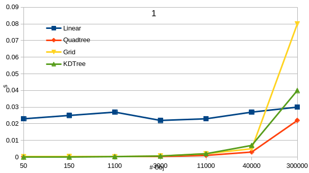
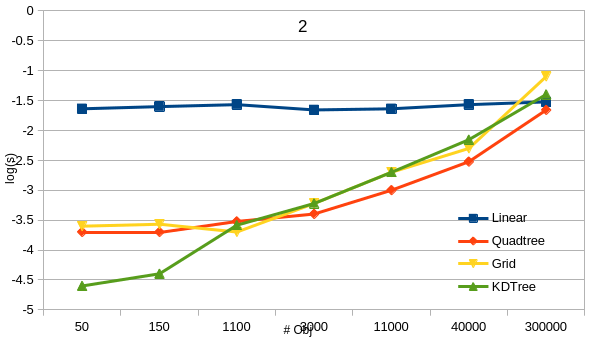
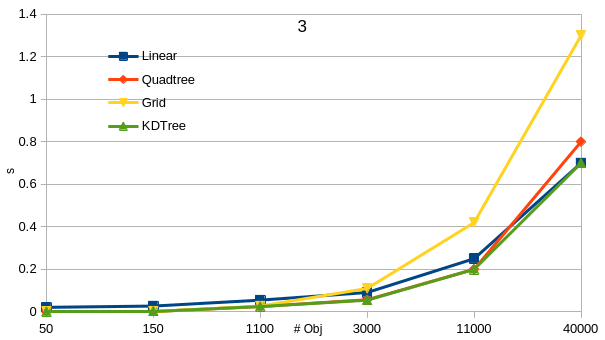
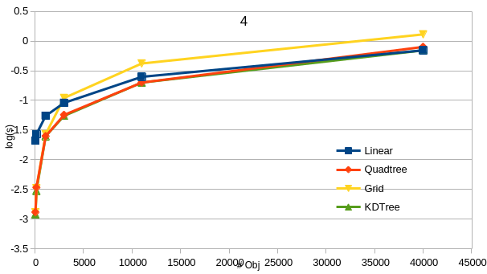

<!-- give me a readme template for github repo based on the current project -->

# QuadTree

QuadTree is a data structure that represents a two-dimensional space by recursively subdividing it into four quadrants. It is particularly useful for spatial partitioning and collision detection in computer graphics and game development.

This project demonstrates the use of QuadTree to efficiently display and manage a collection of basic shapes using the SDL2 library. By utilizing the spatial partitioning capabilities of QuadTree, the project optimizes rendering and collision detection, providing a smooth and responsive user experience.

We also compare the performance of the QuadTree to other tree structures such as grid and KDtree for the same purpose.

Furthermore, we tends to optimize the performance of the QuadTree.

## Table of Contents

- [Usage](#usage)

- [Comments](#comments)

## Usage

You need g++ to compile and run the project. Also, you need have the SDL2 installed.
The project was tested under fedora 38, but it is supposed to work under any linux distribution. 
To compile, run 'cmake .' then "make" in a terminal under the project root directory.

To run the project, run './example'.
The example can be replaced by the following:
 - linear
 - static
 - trees
 - dynamic

Each of these examples will run in a new context. Read the comment at the top of this file to understand what each example does.

## Comments

A question often asked was which tree structure to use or which one is faster. Here we did some intuitive comparisons between the trees emplemented before.

<!-- insert 4 .png pictures in the project subdirectory assets and align them 2 by 2-->

<table>
  <tr>
    <td></td>
    <td></td>
  </tr>
  <tr>
    <td></td>
    <td></td>
  </tr>
</table>

The 2 figs above are the time for only the search of the objects and the bottom 2 are the time for the search and the display of the objects.

From the figures, we see:
 - For linear (fig 3), the search time is constant, which is normal, since this approach traverses the whole list of objects each time.
 - The KDTree is more efficient when there are very few objects (fig 1), but it is less efficient when there are more objects (fig 2). This is because the KDTree is a binary tree, so it is not as efficient when there are more than 2 objects in a node.
 - When there are a lot of objects, the trees are less efficient then the linear approach due to all the search overheads for tree structure.
 - Grid has some wired behavior when there are more objects. This is due to the fact that we fixed the size of the grid which may not be optimal for the testing number of objects. So, to use the grid, one have to find the optimal grid size before using.
 - From the fig 3 and 4, it showed that the most time comsumming part is the display (drawing, at least for my case). So, there is a trade-off between tree performance and the number of displays. Beyound this trade-off, no use to use tree structures.

